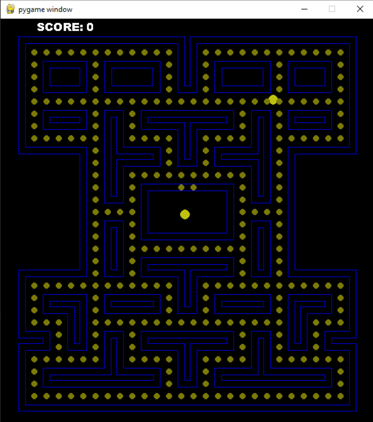

:warning: Everything between << >> needs to be replaced (remove << >> after replacing)
# CS110 Project Proposal
# << Pac-Men >>
## CS 110 Final Project
### << November 28, 2021 >>
### [Assignment Description](https://docs.google.com/document/d/1H4R6yLL7som1lglyXWZ04RvTp_RvRFCCBn6sqv-82ps/edit#)

<< [https://github.com/bucs110b1fall21/final-project-pac-men](#) >>

<< [link to demo presentation slides](#) >>

### Team: << Pac-Men >>
#### << Jason Lin, Axin Li, Nicholas Tavormina >>

***

## Project Description *(Software Lead)*
<< Our project is a recreation of pacman. Pacman is a game where there is a character, pacman and his goal is to eat all the pellets before the ghost catches him.>>

***    

## User Interface Design *(Front End Specialist)*
* << A wireframe or drawing of the user interface concept along with a short description of the interface. You should have one for each screen in your program. >>
    * For example, if your program has a start screen, game screen, and game over screen, you should include a wireframe / screenshot / drawing of each one and a short description of the components
* << You should also have a screenshot of each screen for your final GUI >>

* Start Screen
  * 
  * This is the start screen of the Pacman game. It displays the text, "PUSH SPACE BAR" which instructs the user to press space to transition
  * to the game screen and begin the game. 
    * Game Screen
      * 
      * This is the game screen where it displays the background, Pacman sprite, ghost sprite, and the coins. There is also a score count on the
      * top left of the screen which counts the coins Pacman has eaten. 
        * Game Over Screen
          * 
          * This is the game over screen where it displays "GAME OVER" and the game ends. To exit, you can press ESC and to play again, you restart
          * the program.

## Program Design *(Backend Specialist)*
* Non-Standard libraries 
    Pygame: https://www.pygame.org/docs/
    Set of modules to write, design, and display games within python. Backnbone of most of this project

    Pygame.math: https://www.pygame.org/docs/ref/math.html
    Pygame math is a vector module for pygame classes. I use in it this project in order to create position vectors (grid based and pixel based) for the ghosts and pacman.

    Sys: https://docs.python.org/3/library/sys.html
    Library of variuous functions and functions to use in python. Used only in this project to determine the font of the game text.

    Random: https://docs.python.org/3/library/random.html
    Library of pseudo-random number generators. Used for random Enemy Movement

* Class Interface Design
    * Class Diagram
        * 
        
* Classes
    Ghosts: Handles the ghosts (pacman enemies). Contains methods to derive a random movement pattern, draw themselves, move (change direction), set color, check for collision, centers the movement on a gridpath, and handles the interchange of a grid positioning system (coordinates) and pixel positioning system on the screen.
    Pacman: Handles the player (pacman himself). Contains methods to move (change direction), draw pacman, check collision, centers the movement on a gridpath, handles the checking for and eating of coins, and handles the interchange of a grid positioning system (coordinates) and pixel positioning system on the screen.

## Project Structure *(Software Lead)*

The Project is broken down into the following file structure:
* main.py
* bin
    * <all of your python files should go here>
* assets
    * <all of your media, i.e. images, font files, etc, should go here)
* etc
    * <This is a catch all folder for things that are not part of your project, but you want to keep with your project. Your demo video should go here.>

***

## Tasks and Responsibilities *(Software Lead)*
* You must outline the team member roles and who was responsible for each class/method, both individual and collaborative.

### Software Lead - << Jason Lin >>

<< Worked as integration specialist by developing statrategic procedures and upgrades. >>

### Front End Specialist - << Axin Li >>

<< Front-end lead conducted significant research on how to make sure the presentation of the project looked nice. >>

### Back End Specialist - << Nicholas Tavormina >>

<< The back end specialist made sure that the code was compressed and followed our project description. >>

## Testing *(Software Lead)*
* << One testing strategy we used was to run the code, and whereever theres an error, we would go from there>>
    * << TypeError on line 12. We would go to line 12 and try to fix the error. >>

* Your ATP

| Step                  | Procedure     | Expected Results  | Actual Results |
| ----------------------|:-------------:| -----------------:| -------------- |
|  1  | Run Counter Program  | G UI window appears with count = 0| works fine|
|  2  | click count button  | display changes to count = 1  |starts with count = 1|
|  3  | start game        |press space bar|  runs the code |
|  4  | Play game|use arrow keys to move|pacman moves around with the arrow keys|
|  5  | Collecting pellets | pellets should disappear when eaten| it does! |
|  6  | Ghost follows pacman| if ghost touches pacman he dies| pacman does die|

 
